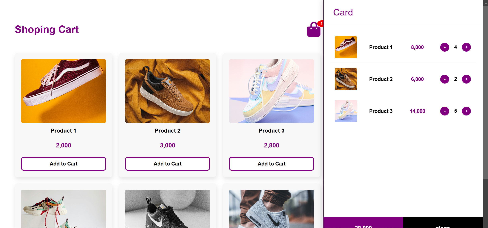

# Shopping Cart Project - README

## Overview

A responsive e-commerce shopping cart system built with HTML, CSS, and JavaScript. This project features product listings, cart functionality with quantity adjustments, and a smooth UI/UX experience.

## Features

- **Product Display**: Grid layout showing available products
- **Shopping Cart**: Side panel that slides in/out
- **Cart Functionality**:
  - Add/remove products
  - Adjust quantities
  - Real-time total calculation
- **Responsive Design**: Works on desktop, tablet and mobile devices
- **Interactive UI**: Hover effects and smooth animations

## Technologies Used

- HTML5
- CSS3 (with Flexbox and Grid)
- JavaScript (ES6)
- Font Awesome (for icons)

## Installation

No installation required - just open the HTML file in a browser. However, for best practice:

1. Clone the repository:

```bash
git clone https://github.com/yourusername/shopping-cart.git
```

2. Open the project folder:

```bash
cd shopping-cart
```

3. Open `index.html` in your browser

1. Browse products in the main grid
1. Click "Add to Cart" to add items
1. Click the shopping bag icon to view your cart
1. In the cart:
   - Use "+" and "-" buttons to adjust quantities
   - View your running total
1. Click "Close" to hide the cart

## License

This project is open source and available under the [MIT License](LICENSE).

## Future Improvements

- Add localStorage to persist cart between sessions
- Implement checkout functionality
- Add product categories/filters
- Include product search
- Add more animations/transitions

## Screenshots


_Product listing page_


_Shopping cart side panel_

## Contact

For questions or suggestions, please contact [ahmed.rabar.dev@gmail.com]
